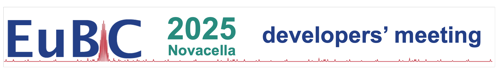

# EuBIC 2025 developers' meeting on Computational Mass Spectrometry
### 2. - 7. February 2025, Vahrn, Italy

This repository is the home for all discussions and proposals regarding the EuBIC-MS Developers Meeting 2025.

💡 Go to [Discussions](https://github.com/EuBIC/EuBIC2025/discussions) to see all hackathon proposals or propose your own idea

🧑‍💻 [Become a EuBIC-MS member](https://eubic-ms.org/become-a-member/) to join the organizational team on Slack
